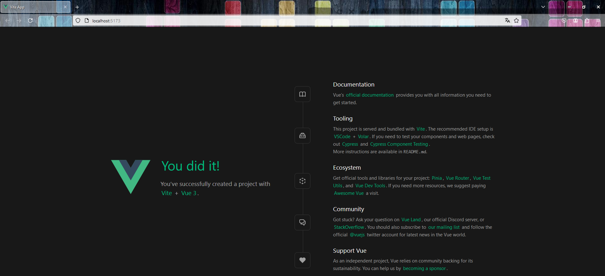
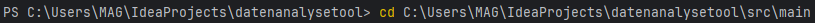
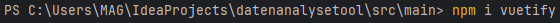

= Installationsanleitung für Ktor, vue.js und vuetify Framework
Renato Huber <renato.huber@stud.abbts.ch>,Marcel Gräub <marcel@graeub@studabbts.ch>
3.0, July 29, 2022: AsciiDoc article template
:toc:
:icons: font
:url-quickref: https://docs.asciidoctor.org/asciidoc/latest/syntax-quick-reference/

== 1.0 Ktor-Projekt erstellen
Das Ktor-Projektskelett kann unter https://start.ktor.io/settings zusammengestellt und heruntergeladen werden.

=== 1.1 Konfiguration des Ktor-Projekts

1. Beim Projekt-Artefact wird der Name für das Projekt vergeben. Dieser ist nach der Erstellung unter settings.gradle.kts wieder auffindbar.In unserem ist das: `ch.heimag.datenanalysetool`

2. Unter "Konfigurieren wurden für dieses Projekt folgende Einstellungen vorgenommen:"
|===
|Build-System: |Gradle Kotlin
|Ktor-Version: |2.3.12
|Engine/"Motor": |Netty
|Konfiguration:  |Code
|===

=== 1.3 Plugins
Die Webseite enthält eine grosse Anzahl an Plugins, welche zum Projekt hinzugefügt werden können.

.Folgende Plugins haben wir für unser Projekt hinzugefügt (Name in Englisch/Deutsch):

* Authentication Basic / Authentifizierung Basic
* Routing
* Call Logging / Anrufprotokollierung
* CSS DSL
* Freemarker
* Exposed / Herausgestellt
* kotlinx.serialization

=== 1.4 Herunterladen und Öffnen
Wurden die Schritte 1.1 bis und mit 1.3 ausgeführt, kann über den "Download" - zu Deutsch "Herunterladen" - Button die Datei heruntergeladen werden. Eine .zip-Datei wird im Download-Ordner abgelegt mit dem Namen des Projekts.

Mit Rechtsklick "Alle extrahieren" und dem gewünschten Ablageort wird das Projekt entpackt und im Ablageort abgelegt.

Mit dem Intellij kann nun das Projekt geöffnet werden.

== 2.0 Einbinden von vue.js
Es gibt mehrere Arten, wie man vue.js in sein Projekt einbinden kann. In unserem fall wählen wir die Einbindung über den Packet-Manager npm. Die Befehle werden dann im Terminal von der IDE eingegeben.

* Weitere Informationen oder Installationsvarianten finden man auf https://vuejs.org/

=== 2.1 Terminal Eingaben
Vom Ablageort des Projekts muss in den den Ablageort/src/main gewechselt werden. Bei diesem Projekt erstellung war der Ablageort 'C:\Users\MAG\IdeaProjects\datenanalysetool>' und von dort wechselten wir in 'C:\Users\MAG\IdeaProjects\datenanalysetool\src\main>'

Anschliessend im gleichen Pfad 'npm create vue@latest', für die aktuellste Version, eingeben.

Bevor der Download definitiv beginnt, müssen mehrere Parameter eingestellt werden. Die Einstellung bei diesem Projekt Stimmen mit den Einstellungen auf dem Bild überein.

Wenn der Download abgeschlossen ist, wird "Done" angezeigt, gefolgt von weiteren "Terminal-Befehlen".

Diese Befehle müssen in genau dieser Reihenfolge im Terminal eingegeben werden.

1 `cd vue-project` Der Pfad wird  gewechselt nach Ablagepfad/vue-project

2 `npm install` installiert nun die Abhängigkeiten von vue. Wenn das geklappt hat, erscheint folgender Text:

3 `npm run format` Die einzelnen Komponenten werden erstellt/gestartet. Anschliessend wird folgender Text angezeigt:

4 `npm run dev` Die Applikation wird durchgestestet. Ist dies erfolgreich, dann erscheint Link.

Wählt man diesen an, muss, wenn alles geklappt hat, die Webseite im Standard-Browser erscheinen mit `You did it`

Vue.js ist nun im Projekt integriert.

== 3.0 Einbinden von vuetify
Auch Vuetify kann man auf mehrere Arten installieren. Bei diesem Projekt wurde vuetify mittels Npm-Paketmanager ins Projekt importiert. Alle Eingaben wurden mit dem Terminal vom Intellij gemacht.

* Weitere Informationen oder Installationsvarianten finden man auf https://vuetifyjs.com/en/

=== 3.1 Terminal Eingaben
In diesem Beispiel liegt das Projekt unter
*C:\Users\MAG\IdeaProjects\datenanalysetool>*

Zuerst muss wieder der Pfad angepasst werden. Im Wesentlichen ist es Ablagepfad->Ablagepfad\src\main

In unserem Beispiel sieht dass nun wie folgt aus:

Anschliessend muss der Befehl `npm i vuetify` im Terminal eingegeben werden. Die vuetify-Pakete werden nun in das bestehende Projekt importiert.

=== 3.2 Programmcode von Webseite laden
Auf https://vuetifyjs.com/en/getting-started/installation/#existing-projects gibt es einen Codeausschnitt welcher main.ts eingefügt werden muss.

main.ts ist unter *Ablagepfad\src\main\vue-project\src* zu finden.
In unserem Beispiel wäre dass: *C:\Users\MAG\IdeaProjects\datenanalysetool\src\main\vue-project\src*

=== 3.3 Programmanpassungen
Eigentlich wäre der Import jetzt fertig. In diesem Projekt wurden allerdings noch eine Programmanpassung durchgeführt.

Anstatt den Code wie bei Kapitel <<3.2 Programmcode von Webseite laden>> direkt ins main.ts einzufügen, haben wir den Code in ein separates TypeScript ausgelagert.

Eine Schritt-für-Schritt-Anleitung für unsere Anpassung:

`1.` Den Ordner "plugins" erstellt unter *Ablagepfad\src\main\vue-project\src*
In unserem Beispiel wäre der Pfad des neuen Ordners: *C:\Users\MAG\IdeaProjects\datenanalysetool\src\main\vue-project\src\plugins*

`2.` Im Ordner "plugins" haben wir nun ein TypeScripte-File angelegt: vuetify.ts

`3.` Darin wurde nun der Code der Vuetify-Webseite eingefügt und leicht angepasst. Dieser sieht nun wie folgt aus:

`4.` Anschliessend im main.ts die Verknüpfung eingefügt:

